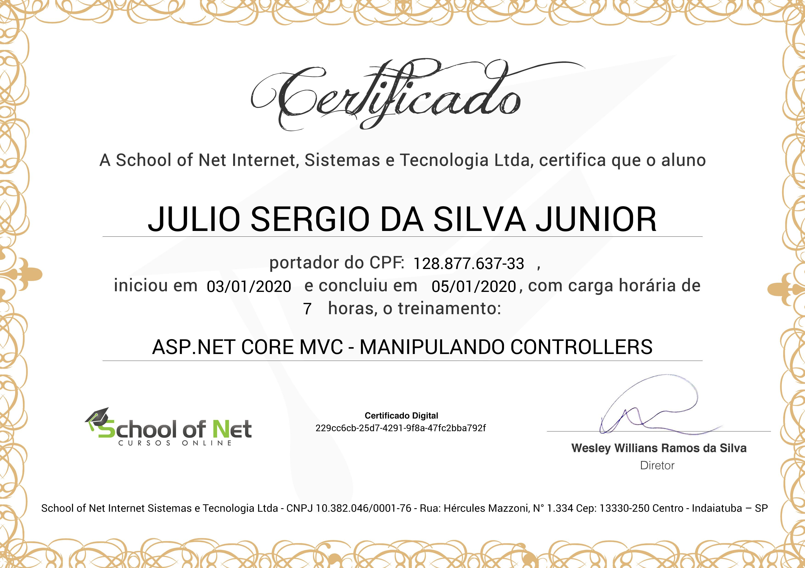

# ASP.NET Core MVC - Manipulando Controllers
## [School of Net](https://www.schoolofnet.com)

* ASP.NET Core MVC

Instrutor: Anybal Rocha

"Neste curso serão apresentadas as várias possibilidades de manipular os controllers de uma aplicação ASP.NET Core MVC. Nesta, iremos ver como rotear as ações do controller, entender e aplicar o model binding, realizar validações, utilização de Injeção de Dependência (DI), entre outros."

